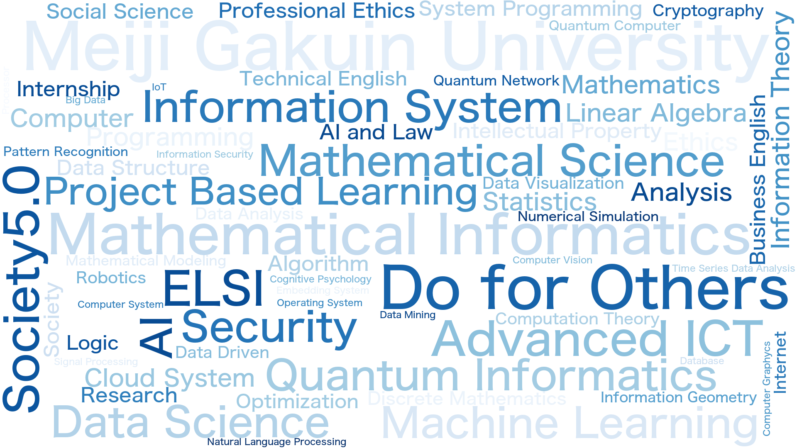

# 情報数理学科のカリキュラム

## 3つのコースと実践的なPBLで、人と社会に貢献する先端IT人材を育てる

近年、AI(人工知能)を中心とした高度情報通信技術(高度ICT)が急速に発展し、われわれの社会を大きく変えつつあります。今後、この高度ICTを支える情報科学を基礎的な視点から理解する数理・データサイエンス教育は世界中でますます重要となり、その技術を活用することができる人材が求められるようになるでしょう。情報数理学科では、AIや量子情報を含む最先端の情報技術の動きを、ICTを活用した授業やProject Based Learning(課題解決型学習)など、新しく柔軟な形態の教育を通じて学びます。

# 学科の特色

1. 数理の力を基礎から養う
    情報技術の進展は急速で、将来の技術革新や変化に対応するためには、数理(数学)の基礎学力が重要になります。1年次では少人数の基礎数学演習を設け、最先端の情報科学に卒業後も長く対応できる力を養います。
1. 高度ICTの利活用
    情報科学の手法(アルゴリズム)の背後にある数学的原理を理解したうえで、人文科学や社会科学など隣接領域への応用例などの知識も有しながら、与えられた具体的な問題を、専門的なデータ分析やプログラミングの能力を用いて解決できる能力を身につけます。
1. 社会とのつながり
    情報科学の単なる技能・技術の修得のみでなく、ELSI(倫理的・法的・社会的課題)に配慮した社会的課題の解決につながる学びを深めます。
1. 実践的なProject Based Learning(PBL)
    PBL(課題解決型学習)を3年次に配置し、実際の企業で行われているようなプロセスを体感できる実践的教育を提供します。このPBLを通じて自発的な仮説形成能力と問題解決能力を養い、将来のキャリアパスを自ら意識できる教育を目指します。

# 領域・流れ

本学科では、AI(人工知能)の急速な発展に伴い、ますます複雑化する現代の情報通信技術(高度ICT)を数理科学の視点から学びます。カリキュラムには「数理・量子情報コース」、「AI・データサイエンスコース」、「情報システム・セキュリティコース」の3コースが設けられ、コースの選択によって学生の志向や特性に合わせた科目提供を行います。また、「Project Based Learning」では学科での学びを活かす実践的な学習を提供し、社会と情報科目群での学びと合わせて情報科学と人間、社会、企業との結びつきを意識した学びも展開します。

## 1年次

### オムニバスの「数理と情報」で学科のカリキュラム全体を俯瞰し、「基礎数学演習」で数学の基礎力を高める

数学やプログラミングなどの基礎を学び、専門科目を学ぶための準備を整えます。また、オムニバス形式授業である「数理と情報」科目を通して、情報数理学の考え方や学科カリキュラムの全体像にふれます。

## 2年次

### 基礎から応用までの幅広い基礎科目を選択しながら、将来のコースと進路の選択を考える

必修科目を含む基礎的な専門科目を学び、3年次のコース選択について考えを深めます。より実践的な内容の科目については、問題演習やプログラミング実習と組み合わせて具体的な問題に対する応用力を高めていきます。

## 3年次

### 興味・関心と進路に応じたコース選択で専門性と応用力を高め、PBLによって実践的な力を身につける

自身の特性や将来の進路に合わせて3つのコースから重点的に学ぶ科目を選択します。また、課題解決型のPBL科目では、実際の企業で行われているようなプロセスを体感し、実践的能力を身につけます。

#### 3年次よりコースを選択

> - 数理・量子情報コース
> - AI・データサイエンスコース
> - 情報システム・セキュリティコース

## 4年次

### 各教員の研究室に配属され、学科での学びを統合した研究課題を完成

各教員の研究室に配属され、それまでの学習成果の集大成となる卒業研究を完成させます。研究室での学びでは英語での文献講読も重視し、世界で発信される最先端の情報科学分野の文献を読みこなせる力を養います。

# 情報数理学科とSDGs

## Society 5.0で実現する持続可能な社会

Society 5.0は情報化社会の次のステップで、サイバー空間とフィジカル空間を高度に融合させたシステムによって開かれる未来社会です。Society 5.0では、様々な知識や情報が格差を超えて共有され、人工知能(AI)などの活用により、少子高齢化、地方の過疎化、貧富の格差など、これからの社会の課題を解決するための新しい技術(高度情報通信技術)が生み出されていくことが期待されています。また、エネルギー資源や環境の問題、人や物の流れの不効率さを解消するためにも、データ駆動型の発想や数理モデルを使った科学的思考が必要不可欠です。情報数理学科では、持続可能な社会を未来に実現するための技術基盤を基礎から学ぶことができます。
